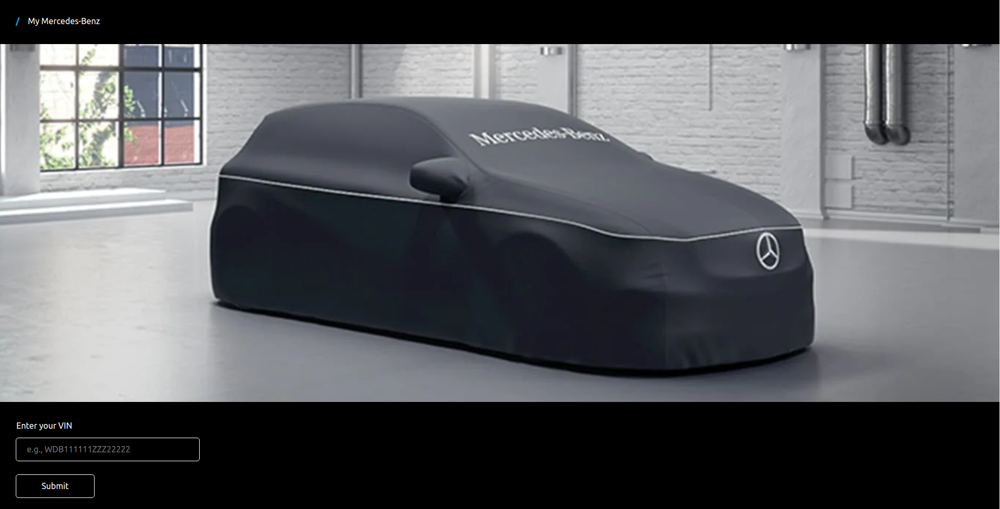
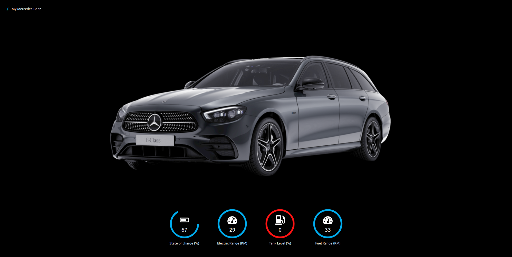
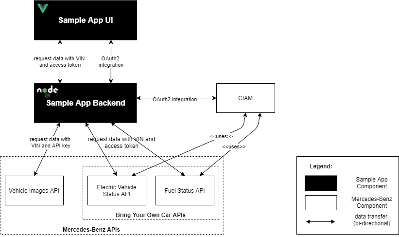

= BRING-YOUR-OWN-CAR (BYOCAR) Sample App
:experimental:
:idprefix:
:idseparator: -
ifndef::env-github[:icons: font]
ifdef::env-github,env-browser[]
:toc: preamble
:toclevels: 3
endif::[]
ifdef::env-github[]
:status:
:outfilesuffix: .adoc
:!toc-title:
:important-caption: :exclamation:
:note-caption: :paperclip:
:tip-caption: :bulb:
:warning-caption: :warning:
endif::[]

The BRING-YOUR-OWN-CAR (BYOCAR) Sample App is a simple web application
that consists of a UI and corresponding backend for frontend application
that interacts with Mercedes-Benz APIs. The purpose of this sample is to
portray how you as a developers can integrate public
https://developer.mercedes-benz.com/[Mercedes-Benz APIs] into your
application. BYOCAR is an initiative from Mercedes-Benz /developers.

== Use Case

The sample app is intended to showcase the usage of the public APIs with
different authentication mechanisms - OAuth and API key. Therefore,
a simple use case was selected that the developers can focus on the
integration of the APIs.

The use case itself is showing images, the electric or fuel status for a Mercedes-Benz car
of a logged-in Mercedes me user.

The app provides a user login where the Mercedes me credentials have to be used. After
a successful login, a dashboard is shown where the logged-in user can enter the
VIN of the related Mercedes me identity.

If the VIN is valid, the app will request the data of your Mercedes-Benz at some public APIs
(link:#electric-vehicle-status[Electric Vehicle Status], link:#fuel-status[Fuel Status],
and link:#vehicle-images[Vehicle Images]) and show it to the user:

* images of the car
* the electric or fuel status of the car (or both if it is a hybrid car)

== BYOCAR - Bring-Your-Own-Car Initiative

The Bring-Your-Own-Car API collection is a subset of Mercedes-Benz APIs which
provides API subscriptions to test and develop your apps in a real environment
and with real data. The BYOCAR APIs are free to use and limited to extract data
from your own Mercedes-Benz car only. This variant is intended for developing
your private ideas, not for real business.

Check out more https://developer.mercedes-benz.com/news/byocar[BYOCAR
details] in our Developer Portal.

See how the https://developer.mercedes-benz.com/inspire/openhab[openHAB]
community uses our connected car APIs for smart home integration.

=== Precondition for BYOCAR

* your own Mercedes-Benz must be linked to your Mercedes me ID
* you need to register in the Mercedes-Benz /developers portal with the
same ID

Once you have created a project and subscribed to APIs, you find
everything you need to explore your vehicle’s data through our APIs.

=== BYOCAR Public Postman Collection

Mercedes-Benz provides a
https://www.postman.com/mbdevelopers/workspace/mercedes-benz-bringyourowncar/overview[public
postman collection] that contains all the APIs belonging to BYOCAR:

* https://developer.mercedes-benz.com/products/vehicle_status[Vehicle
Status]
* https://developer.mercedes-benz.com/products/vehicle_lock_status[Vehicle
Locks Status]
* https://developer.mercedes-benz.com/products/pay_as_you_drive_insurance[Pay
As You Drive Insurance]
* https://developer.mercedes-benz.com/products/electric_vehicle_status[Electric
Vehicle Status]
* https://developer.mercedes-benz.com/products/fuel_status[Fuel Status]

You can use all the requests from the collections to access data
associated with your own car. The requests are prepared with a set of
general variables that are used across APIs.

To get started, fork the collection ``BYOCAR - Bring your own car'' to
your own postman workspace.

With that, you are almost ready to start using the BYOCAR APIs.

== Overview

The following diagram shows an overview of all involved components for
the sample app, including used APIs and the authentication provider:

=== Sample App UI

The Sample App UI is the entry point from the end-user’s perspective.

After entering the VIN (vehicle identification number) of her car, the
user is redirected to the Mercedes me login page for authentication and
to authorize the application to access vehicle-related data.

Once logged in, the Sample App will show an individually rendered image
and vehicle status information. The required dashboard data is retrieved
from the Sample App Backend application.

The Sample App UI is implemented using https://vuejs.org/[Vue.js].

=== Sample App Backend

The Sample App Backend application acts as ``backend for frontend'' and
interacts with the Mercedes-Benz APIs in order to fetch and aggregate
the data that is needed to display the vehicle status information and
image in the UI.

It acquires a JWT (JSON Web Token) access token from Mercedes-Benz’s
link:#ciam[identity provider and
auth server] that is used in requests to APIs that use OAuth
authentication (link:#byocar---bring-your-own-car[BYOCAR] APIs):

* link:#electric-vehicle-status[Electric Vehicle Status]
* link:#fuel-status[Fuel Status]

The access token is only used in the backend application, i.e., it must
not be sent to the frontend running in the web browser.

Besides the BYOCAR APIs, the application also integrates the
link:#vehicle-images[Vehicle Images] API that uses API key
authorization.

The Sample App Backend is implemented as a https://nodejs.org/[Node.js]
server using https://expressjs.com/[Express]. It exposes an HTTP/REST
API to provide the aggregated dashboard data to the frontend.

=== CIAM

CIAM (Customer Identity and Access Management) is a Mercedes-Benz identity provider and authorization
server. It authorizes both users and client applications using the
https://datatracker.ietf.org/doc/html/rfc6749#section-1.3.1[OAuth 2.0
Authorization Code grant].

=== Mercedes-Benz APIs

IMPORTANT: All APIs requires a link:#api-subscription[subscription in the
Mercedes-Benz /developers Portal].

==== Vehicle Images

The https://developer.mercedes-benz.com/products/vehicle_images[Vehicle
Images API] lets you easily illustrate the virtual copy of a specific
car by the use of its unique vehicle identification number. The API
provides representations of an exact virtual copy of the car, i.e.,
exact vehicle colors, interior and exterior view, multiple perspectives,
and day and night atmosphere.

* https://developer.mercedes-benz.com/products/vehicle_images/details[Details]
* https://developer.mercedes-benz.com/products/vehicle_images/specifications/vehicle_images_api[API
Specification]
* https://developer.mercedes-benz.com/products/vehicle_images/docs[API
Reference]

==== Bring Your Own Car APIs
===== Electric Vehicle Status

The
https://developer.mercedes-benz.com/products/electric_vehicle_status[Electric
Vehicle Status API] enables you to remotely check the battery charge and
remaining range of a specific electric vehicle that is identified by its
VIN.

* https://developer.mercedes-benz.com/products/electric_vehicle_status/details[Details]
* https://developer.mercedes-benz.com/products/electric_vehicle_status/specifications/electric_vehicle_status_api[API
Specification]
* https://developer.mercedes-benz.com/products/electric_vehicle_status/docs[API
Reference]

===== Fuel Status

The https://developer.mercedes-benz.com/products/fuel_status[Fuel Status
API] provides remote access to the fuel level and the remaining vehicle
range of a connected vehicle by VIN.

* https://developer.mercedes-benz.com/products/fuel_status/details[Details]
* https://developer.mercedes-benz.com/products/fuel_status/specifications/fuel_status_api[API
Specification]
* https://developer.mercedes-benz.com/products/fuel_status/docs[API
Reference]

== API Authentication

The Mercedes-Benz APIs are secured using different authentication
mechanisms depending on the type of data they provide. APIs which
provide user-related data are secured using OAuth 2.0 with either
link:#authorization-code-flow-authentication[authorization code flow] or
https://developer.mercedes-benz.com/content-page/oauth-documentation#_client_credentials[client
credentials flow], while the APIs that do not provide any personal user
data can be easily link:#api-key-authentication[authenticated using your
secret API key]. The OAuth flows within Mercedes-Benz are described in the
https://developer.mercedes-benz.com/content-page/oauth-documentation#_general_handling_of_credentials_and_token[Mercedes-Benz portal].

For our Sample App, the Electric Vehicle Status API and Fuel Status API
provide vehicle-related data, i.e., data that is related to the caller’s
vehicle. Hence, these APIs require OAuth authentication via the
authorization code flow.

Requests to the Vehicle Images API that provides generated images can be
authenticated using your secret API key.

=== Authorization Code Flow Authentication

To initiate this flow the Sample App UI redirects the end user’s browser
to the authorization endpoint of the identity provider. This will
provide a login screen to the end user for authentication.

Example Authorization Request:

....
https://id.mercedes-benz.com/as/authorization.oauth2 \
  ?response_type=code \
  &client_id=<insert_your_client_id_here> \
  &redirect_uri=<insert_redirect_uri_here> \
  &scope=<insert_scopes_of_API_here> \
  &state=<insert_client_state_here>
....

The URL uses the following parameters:

[cols="m,,",options="header",]
|===
|Parameter |Description |Value for the Sample App
|response_type |Request an authorization code as the result of the end
user authorization process. |`code`

|client_id |Provide the client ID of your application or project from
the Console in the Mercedes-Benz /developers Portal. |_your client ID_

|redirect_uri |This is the callback URL that is registered for you
application in order to receive the authorization code (as configured
for your project in the Console in the Mercedes-Benz /developers
Portal). |`http://localhost:8080/`

|scope |Include the scopes for the API, which are the permissions to
request the end user’s consent to access the related data. For each API,
you can find the required scopes in the corresponding API reference.
|`mb:vehicle:mbdata:fuelstatus mb:vehicle:mbdata:evstatus offline_access`

|state |An opaque value used by the client to maintain state between
the request and callback. The authorization server includes this value
when redirecting the user-agent back to the client. The parameter SHOULD
be used for preventing cross-site request forgery. |_your state value_
|===

The end user will have to authenticate using her credentials on
Mercedes-Benz login page and give consent for the sample application to
access her data.

The Authorization Server then redirects the end user with an
authorization code to the redirect URL included in the authorization
request.

Example Redirect URL:

....
http://localhost:3000/?code=maPVvNWs96r5pDRawvvil5__uYf7qjlyb7hXvqBo&state=xyz
....

The Sample App UI extracts the `code` parameter from the URL and passes
it to the Sample App backend.

The Sample App Backend then can exchange this authorization code with an
access token from the the Authorization Server.

Example Token Request:

[source,sh]
----
curl --request POST 'https://id.mercedes-benz.com/as/token.oauth2' \
  --header 'Authorization: Basic <insert_your_base64_encoded_client_id_and_client_secret_here>' \
  --header 'content-type: application/x-www-form-urlencoded' \
  --data 'grant_type=authorization_code&code=<insert_authentication_code_here>&redirect_uri=<insert_redirect_uri_here>'
----

The token request from the Sample App backend uses HTTP Basic
authentication for the request to the authorization server. Your
application’s/project’s client ID and client secret from the Console in
the Mercedes-Benz /developers Portal. The credentials are included in
the `Authorization` header as base64-encoded string:

....
Authorization: Basic base64(<client_id>:><client-secret>)
....

The `grant_type=authorization_code'` indicates the token endpoint to use
the OAuth 2.0 Authorization Code Flow for this request.

The server responds with an access token response that includes a Bearer
token which can be used in requests to the Electric Vehicle Status and
Fuel Status APIs as follows:

[source,sh]
----
curl --request GET 'https://api.mercedes-benz.com/vehicledata/v2/vehicles/<inser_your_vin_here>/resources/rangeelectric' \
  --header 'Accept: application/json' \
  --header 'Authorization: Bearer <insert_your_access_token_here>'
----

=== API Key Authentication

The Vehicle Images API can be easily authenticated using your API key as
follows:

[source,sh]
----
curl --request GET 'https://api.mercedes-benz.com/tryout/vehicle_images/v1/vehicles/<insert_your_vin_here>?roofOpen=false&night=false&background=false&cropped=false&jpeg=false&apikey=<insert_your_api_key_here>' \
  --header 'Accept: application/json'
----

== Project Structure

This monorepo contains two packages:

[cols="m,",options="header",]
|===
|Directory |Description
|link:./packages/ui[./packages/ui/] |Vue.js frontend application
|link:./packages/backend[./packages/backend/] |Node.js Express backend application
|===

== Prerequisites

=== Tools

To work with the sample from this repository, you will need to have the
following tools installed:

* https://nodejs.org/en/download/[Git] (MacOS and Linux machines
typically have this already installed)
* https://nodejs.org/en/download/[Node.js] and the NPM package manager
(included in the installation)

=== API Subscription

Before you start with using the sample app for your Mercedes-Benz you have to follow some
subscription steps to ensure the app can be properly used.
Your Mercedes-Benz must be linked to your Mercedes me ID, and 
you need to be registered in the https://developer.mercedes-benz.com/[Mercedes-Benz /developers Portal]
with the same ID, and then subscribe to the APIs you will need for the sample app:

1. Log in to the https://developer.mercedes-benz.com/[Mercedes-Benz /developers Portal]
with your Mercedes me ID that is connected to your vehicle.
2. Create/add a new app in your console in order to receive an App ID for the sample app.
3. Choose the vehicle data related API product you would like to integrate and click the “get access” button. Starting from your console click the "add project" button instead.
4. In the subsequent subscription process, select the „BRING YOUR OWN CAR“ option
to use the link:#electric-vehicle-status[Electric Vehicle Status] and
link:#fuel-status[Fuel Status] APIs for your show case of the sample app and your vehicle for free.
5. Additionally, select the link:#vehicle-images[Vehicle Images]
API as tryout variant (for free) for the sample app and your vehicle in the subscription process.

NOTE: Note that the BYOCAR APIs are secured using the OAuth Authorization
Code flow, and scopes are required to access an API. The Vehicle Images API is
secured by an API key. The credentials for all APIs will be shared once in the
console of the Developer Portal after finishing the subscription process.

Also see the https://developer.mercedes-benz.com/home/developer[documentation for developers] in
the Mercedes-Benz /developers Portal for further information.

== Project Setup

The following script will install the required dependencies for both
packages.

[source,sh]
----
npm install
npm run bootstrap
----

=== Test Execution

You can use lerna to run all tests together, for both the frontend and
the backend part. Execute the following command from the root of the
repository:

[source,sh]
----
npm run test
----

If you prefer to run the tests for the components individually, change
to the corresponding directory and run the same command:

Frontend:

[source,sh]
----
cd packages/ui && npm run test
----

Backend:

[source,sh]
----
cd packages/backend && npm run test
----

=== Configuration

Before you can run the application, the API credentials acquired earlier
need to be configured. You can either set environment variables, or
update configuration files for backend and frontend.

==== Environment Variables

Modify the below command to match your credentials and run it:

[source,sh]
----
export CLIENT_ID=<YOUR CLIENT ID>
export VUE_APP_CLIENT_ID=<YOUR CLIENT ID>
export CLIENT_SECRET=<YOUR CLIENT SECRET>
export API_KEY=<YOUR API_KEY>
----

==== Configuration Files

If you prefer configuration files rather than configuration via
environment variables, replace the placeholders and set your credentials
in these configuration files:

* link:./packages/ui/src/config.js[`packages/ui/src/config.js`]
* link:./packages/backend/src/config.js[`packages/backend/src/config.js`]

==== Tryout Mode

If you do not have API subscriptions yet, you can also run the
application in _tryout_ mode. For that, set the following environment
variable in addition to those mentioned above:

[source,sh]
----
export USE_TRYOUT=true
----

Alternatively, you can also update the configuration in the backend
link:./packages/backend/src/config.js[configuration file].

In tryout mode, obtaining an access token from the authorization server
will not work but also is not needed. Instead, the application will use
hard-coded tryout credentials that you can also find in the
https://developer.mercedes-benz.com/[Mercedes-Benz /developers Portal].

IMPORTANT: The tryouts of the different APIs work with different vehicle
IDs (VINs). Therefore, it is not possible to retrieve both vehicle data
(fuel status and electric vehicle status) and vehicle images for the
same VIN. You can use the tryout VINs listed in the portal specification 
section (also included in the oas yaml files).

=== Run the Application

The following script will run the packages on localhost:

....
npm run start
....

The applications will be available on these ports/via these base URLs:

[cols=",",options="header",]
|===
|Application |Base URL
|UI |http://localhost:8080
|Backend |http://localhost:3000
|===

== Contributing

We welcome any contributions. If you want to contribute to this project,
please read the link:./CONTRIBUTING.md[contributing guide].

== Code of Conduct

Please read our
https://github.com/Daimler/daimler-foss/blob/master/CODE_OF_CONDUCT.md[Code
of Conduct] as it is our base for interaction.

== License

This project is licensed under the link:./LICENSE[MIT license].

== Provider Information

Please visit https://www.daimler-tss.com/en/imprint/ for information on
the provider.

Notice: Before you use the program in productive use, please take all
necessary precautions, e.g. testing and verifying the program with
regard to your specific use. The program was tested solely for our own
use cases, which might differ from yours.
